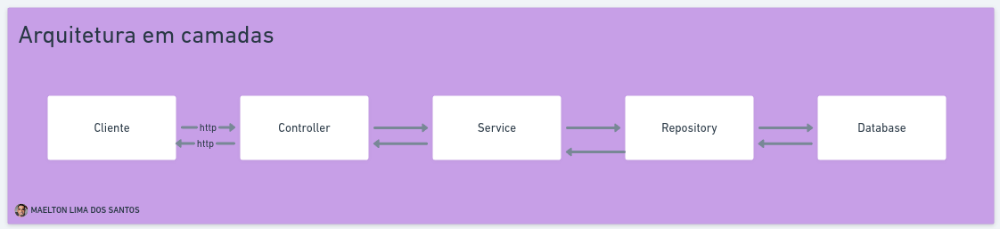

# Stack da Projeto

Detalhamento das principais tecnologias e ferramentas utilizadas no projeto.

## Frontend

### Linguagem de programação
- [TypeScript](https://www.typescriptlang.org/)

### Frameworks
- [Vite](https://vite.dev/) + [shadcn/ui](https://ui.shadcn.com/) + [TailwindCSS](https://tailwindcss.com/) + [TanStack](https://tanstack.com/)

### Package managers
- [pnpm](https://pnpm.io/pt/)

### Testes
- [Jest](https://jestjs.io/pt-BR/)

## Backend

### Software Architecture

### Linguagem de programação
- Java *(JDK 21 LTS)*

### Frameworks
- Spring *(v3.3.3)*
    - Spring Boot
    - Spring Data JPA
    - Spring Security

### ORM
- Hibernate

### Package manager
- Maven

### Testes
- Spring Testing
    - JUnit 5
    - Mockito
    - AssertJ

### Banco de dados
- PostgreSQL
- H2 Database *(used for tests)*

### Containerização
- Docker
